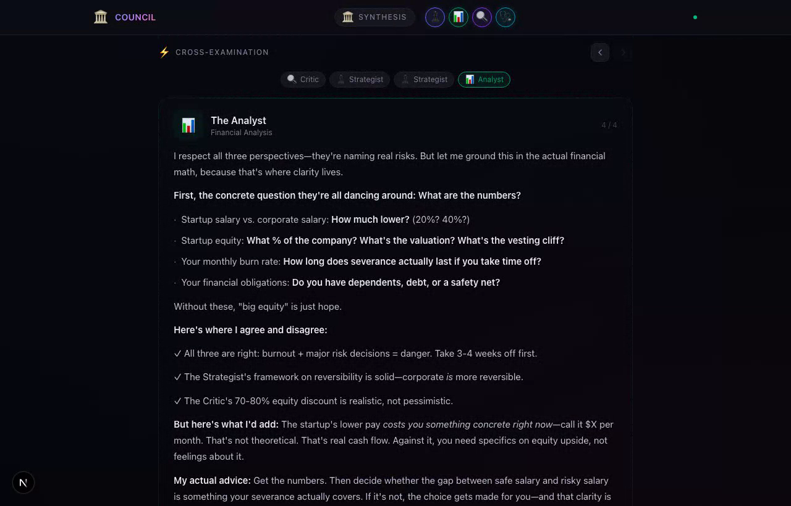
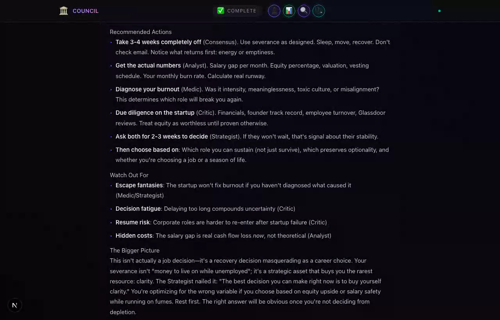

# 🏛️ COUNCIL

**A personal board of AI advisors that deliberate, cross-examine each other, and synthesize one decision.**

Most AI tools give you a single voice. COUNCIL convenes eight specialized agents, routes your question to the ones that matter, lets them argue in front of you, and then distills the disagreement into a plan you can act on. You watch the whole deliberation happen in real time.


*Real deliberation, recorded end to end: routing → parallel perspectives → cross-examination → synthesis. Nothing is scripted; every panel is a live model call.*

---

## What this demonstrates

This is a working multi-agent orchestration system, not a prompt wrapper around one model. The interesting engineering is in how the agents relate to each other:

- **Agents with identity, not just system prompts.** Eight advisors, each with its own expertise, voice, debate posture, and boundaries (when to defer to another advisor). They behave differently and disagree on purpose.
- **A real router.** An LLM reads the question and selects the 3 to 5 advisors that fit, with rules baked in (the Critic joins any major decision; the Medic joins when there are signs of stress). Different questions convene different councils.
- **True cross-examination.** Each advisor is shown the others' opening perspectives and responds to them by name, building on, challenging, and steelmanning. This is where single-model tools stop and this one keeps going.
- **Synthesis as a separate role.** A dedicated synthesizer (not one of the advisors) reads the full transcript and produces consensus, the disagreements that actually matter, prioritized actions, and blind spots.
- **Streamed in real time.** The frontend renders each phase as events arrive over a WebSocket, so the deliberation is something you watch unfold, not a spinner followed by a wall of text.
- **Provider-agnostic.** The model client auto-detects an Anthropic key and otherwise speaks the OpenAI-compatible API, so the same engine runs on Anthropic directly, DigitalOcean Gradient, or any OpenAI-compatible endpoint, and mixes models per role (a fast model for the eight advisors, a stronger model for synthesis).

## How it works

1. **You bring a question.** Any real decision: a layoff, a legal dispute, a career change, debt.
2. **Routing.** The router model picks the most relevant advisors for this specific question.
3. **Perspectives.** The chosen advisors answer in parallel, each from their own expertise.
4. **Cross-examination.** Advisors read each other's takes and respond, challenging assumptions and adding what the others missed. The Critic leads the first round.
5. **Synthesis.** A separate synthesizer turns the whole exchange into agreement, tension, an ordered action plan, and risks to watch.

## The advisors

| Advisor | Expertise | Style |
|---------|-----------|-------|
| ♟️ The Strategist | Long-term planning, systems thinking | Calm, Socratic, methodical |
| ⚖️ The Advocate | Legal rights, bureaucracy, protections | Sharp, assertive, detail-oriented |
| 📊 The Analyst | Financial analysis, budgeting, data | Data-driven, blunt, precise |
| 🧭 The Mentor | Career growth, skill development | Warm, encouraging, experienced |
| 🔍 The Critic | Assumption testing, risk identification | Contrarian, rigorous, steelmanning |
| 💡 The Creative | Unconventional solutions, reframing | Playful, lateral, boundary-pushing |
| 🩺 The Medic | Health, wellness, stress management | Empathetic, evidence-based |
| 📚 The Historian | Precedents, patterns, context | Scholarly, narrative-driven |

## Architecture

```
                          User question
                               │
                               ▼
                        ┌─────────────┐
                        │   Router     │   LLM selects 3-5 relevant advisors
                        └──────┬──────┘
                               │
                               ▼
        ┌────────────────────────────────────────────────┐
        │            Phase 1: Perspectives               │
        │   ┌──────┐  ┌──────┐  ┌──────┐  ┌──────┐       │
        │   │ ♟️   │  │ 📊   │  │ 🔍   │  │ 🩺   │        │  run in parallel
        │   │Strat.│  │Analy.│  │Critic│  │Medic │       │
        │   └──────┘  └──────┘  └──────┘  └──────┘       │
        └────────────────────────┬───────────────────────┘
                                  │  each advisor is fed the others' takes
                                  ▼
        ┌────────────────────────────────────────────────┐
        │         Phase 2: Cross-Examination             │
        │   Advisors respond to each other by name,      │
        │   challenge assumptions, steelman, add nuance  │
        └────────────────────────┬───────────────────────┘
                                  │
                                  ▼
        ┌────────────────────────────────────────────────┐
        │            Phase 3: Synthesis                  │
        │   A separate synthesizer produces:             │
        │   • where the advisors agree                   │
        │   • where they disagree and why it matters     │
        │   • a prioritized action plan                  │
        │   • risks and blind spots                      │
        └────────────────────────────────────────────────┘
```

Every phase streams to the browser over a WebSocket as it completes.

## What it looks like

| Perspectives | Synthesis |
|---|---|
|  |  |

## Tech stack

**Backend**
- Python and FastAPI, async, with a WebSocket streaming the deliberation
- A small provider-agnostic model client (Anthropic or any OpenAI-compatible endpoint)
- The orchestration engine: router, parallel advisor agents, cross-examination rounds, synthesizer
- SQLAlchemy and aiosqlite for session and message persistence

**Frontend**
- Next.js 15 (App Router) and React 19
- Tailwind CSS v4, a dark council-chamber UI
- Framer Motion for the phase transitions and advisor carousels
- A WebSocket client that renders each event as it streams in

**Tests**
- Playwright end-to-end suite covering the landing stage, the full deliberation flow, and responsive layouts

## Run it locally

**Prerequisites:** Python 3.12+, Node.js 20+, and an API key (an Anthropic key, or DigitalOcean Gradient access, or any OpenAI-compatible endpoint).

```bash
git clone https://github.com/brookejlacey/council.git
cd council
```

**Backend**

```bash
cd backend
python -m venv .venv
source .venv/bin/activate          # .venv\Scripts\activate on Windows
pip install -r requirements.txt

cp .env.example .env
# Put your key in .env. The client auto-detects an Anthropic key (sk-ant-...).
# To run on Anthropic, also set the model names to Anthropic model IDs, e.g.:
#   ADVISOR_MODEL=claude-haiku-4-5
#   ROUTER_MODEL=claude-haiku-4-5
#   SYNTHESIS_MODEL=claude-sonnet-4-5
```

```bash
uvicorn app.main:app --reload --port 8000
```

**Frontend** (in a second terminal)

```bash
cd frontend
npm install
npm run dev
```

Open [http://localhost:3000](http://localhost:3000) and bring something to your Council.

**Tests**

```bash
cd frontend
npm test
```

## Configuration

All settings are environment variables (see `backend/.env.example`):

| Variable | Purpose | Default |
|---|---|---|
| `DO_MODEL_ACCESS_KEY` | API key (Anthropic or OpenAI-compatible) | required |
| `DO_INFERENCE_URL` | OpenAI-compatible base URL (ignored for Anthropic keys) | DigitalOcean Gradient |
| `ADVISOR_MODEL` | Model the eight advisors run on | `llama3.3-70b-instruct` |
| `ROUTER_MODEL` | Model that selects advisors | `llama3.3-70b-instruct` |
| `SYNTHESIS_MODEL` | Model that writes the final synthesis | a Claude Sonnet model |

The split is deliberate: a fast model carries the eight advisor calls and the routing, and a stronger model handles the one synthesis call where reasoning quality matters most.

## A note on scope

COUNCIL provides multi-perspective analysis, not professional advice. Several advisors carry explicit disclaimers and point you to a licensed attorney, CPA, or clinician for decisions that need one.

## License

MIT, see [LICENSE](./LICENSE).
